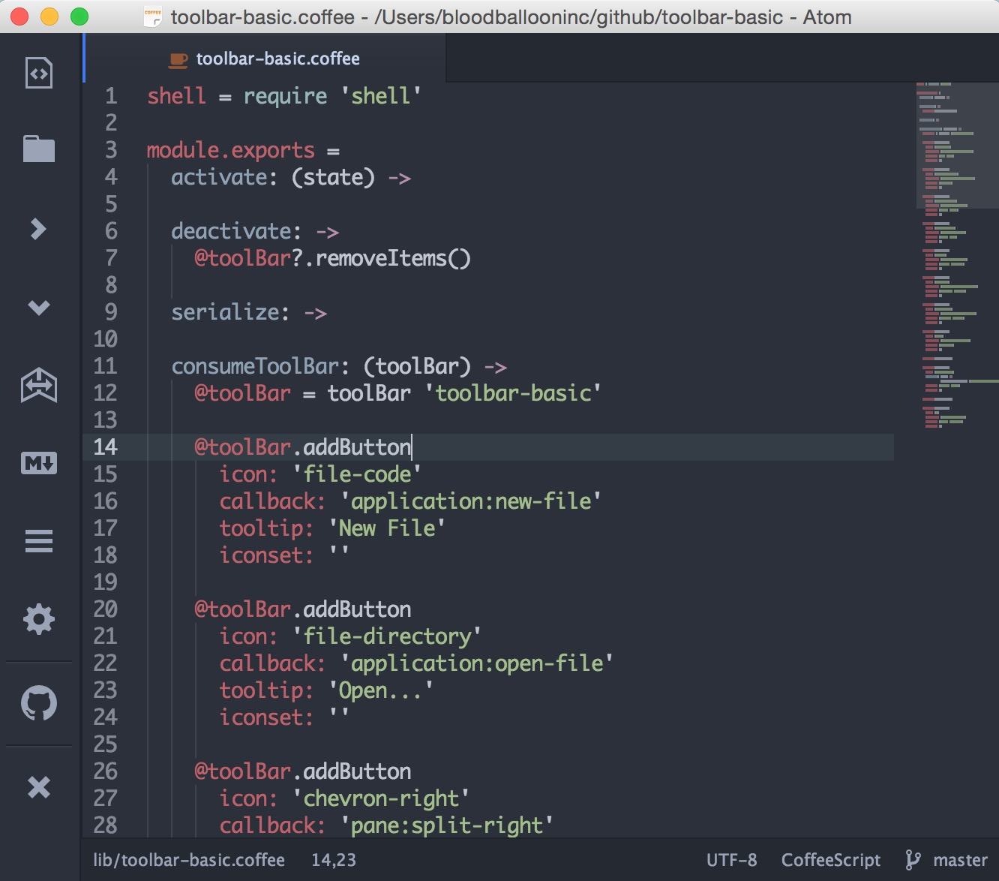

# toolbar-basic package

This is a basic add-on package for the [Tool-Bar Package](https://github.com/suda/tool-bar) written by:  [Suda](https://github.com/suda)

It's meant to be a really basic toolbar offering practical access to a few of the great features Atom has to offer. If you want a really nice customizable package for tool-bar, check out: [Flex-Toolbar](https://github.com/cakecatz/flex-toolbar), written by: [CakeCatz](https://github.com/cakecatz).

###I recommend using the 24px size setting.

You can get away with the 16px setting, but I feel 24px is spot on. 32px is just BIG. You can change these settings in the main tool-bar package settings section. Go to Settings-->Packages-->Tool-Bar. You'll see the "Gear" Icon. That is where you can change things.

###Functionality:

* New File
* Open File
* Split Pane Right
* Split Pane Down
* Toggle Tree-View
* Markdown Preview
* Toggle Command Palette
* Settings
* GitHub Login (Opens Default Browser)
* Hide Tool-Bar (To turn back on go to: Packages-->Tool Bar-->Toggle)

By nature, the choice of icons and functionality is fairly opinionated. It's not my way of saying **this** is what I feel like **you** should have quick access to. I wrote it as a companion to what is at the moment, my workflow in Atom. I wanted to share it with anyone that would find it useful.

: )

###On External Links:

In case you might wish to know how the external links work, I dug through CakeCatz Flex-Toolbar and found the chunck of code necessary to open urls.

In this package's toolbar-basic.coffee file you'll find the code you need to do this.

###Credits

A big thanks to [Suda](https://github.com/suda) for making the tool-bar package. And for some of the example code.

And to [CakeCatz](https://github.com/cakecatz) for making the flex-toolbar and for the url code.
